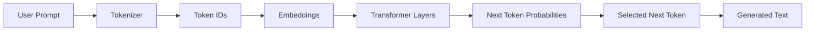
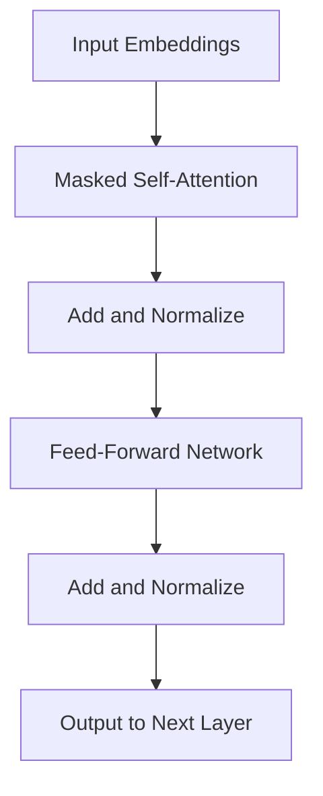
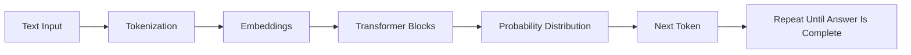
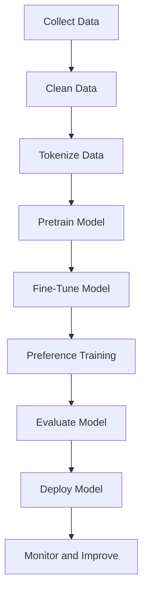

# Generative AI Foundations

## Purpose

This note explains the foundations of Generative AI in a beginner-friendly way. It is written for students who are starting with AI, LLMs, GPT-style models, prompting, RAG, or AI application development.

---

## Table of Contents

1. [Origin of Generative AI](#1-origin-of-generative-ai)
2. [Meaning of Generative AI](#2-meaning-of-generative-ai)
3. [How a Transformer Works in GPT](#3-how-a-transformer-works-in-gpt)
4. [How Is Predicting the Next Letter So Fast?](#4-how-is-predicting-the-next-letter-so-fast)
5. [Attention Is All You Need](#5-attention-is-all-you-need)
6. [What Are Tokens and How Do They Work?](#6-what-are-tokens-and-how-do-they-work)
7. [How Does AI Understand the Relationship Between Words?](#7-how-does-ai-understand-the-relationship-between-words)
8. [What Are Self-Attention and Multi-Head Attention?](#8-what-are-self-attention-and-multi-head-attention)
9. [How Does an LLM Work?](#9-how-does-an-llm-work)
10. [How Does Model Training Happen?](#10-how-does-model-training-happen)

---

# 1. Origin of Generative AI

Generative AI did not suddenly appear with ChatGPT. It is the result of decades of progress in statistics, machine learning, neural networks, and large-scale computing.

The basic idea behind generative AI is:

> Learn patterns from existing data, then generate new data that follows similar patterns.

Earlier machine learning systems were mostly used for **prediction** or **classification**.

Examples:

| Traditional AI Task | Example |
|---|---|
| Classification | Is this email spam or not spam? |
| Regression | What will the house price be? |
| Detection | Is there a cat in this image? |

Generative AI goes one step further.

| Generative AI Task | Example |
|---|---|
| Text generation | Write an email, poem, answer, or code |
| Image generation | Create a product photo or design |
| Audio generation | Generate music or voice |
| Video generation | Create video clips |
| Code generation | Write Python, Dockerfiles, Kubernetes YAML |

## Short History

| Period | Development | Importance |
|---|---|---|
| Early AI and statistics | Markov chains, probabilistic models, n-gram language models | Systems started predicting the next word based on previous words |
| 2000s | Neural networks improved with more data and GPUs | Models became better at learning complex patterns |
| 2013 | Variational Autoencoders, or VAEs | Neural networks could learn compressed representations and generate data |
| 2014 | Generative Adversarial Networks, or GANs | Two networks competed: one generated data, the other judged it |
| 2017 | Transformer architecture | Attention-based models became faster and better for language |
| 2018 onward | GPT-style models | Large transformer models became powerful text generators |
| 2020 onward | Diffusion models | High-quality image generation improved significantly |
| 2022 onward | ChatGPT and modern AI tools | Generative AI became widely usable by the public |

## Key Point

Modern generative AI is powerful because three things came together:

1. **Huge datasets**
2. **Powerful GPUs/TPUs**
3. **Better neural network architectures, especially Transformers**

---

# 2. Meaning of Generative AI

Generative AI means AI that can **generate new content**.

It can generate:

- Text
- Images
- Code
- Audio
- Video
- Data
- Summaries
- Answers
- Designs
- Documents

A normal AI system may identify something.

Example:

```text
Input: Image of a dog
Output: This is a dog
```

A generative AI system can create something new.

Example:

```text
Input: Create an image of a dog wearing sunglasses
Output: A newly generated image
```

For text-based generative AI, such as GPT, the model generates text by repeatedly predicting the next **token**.

A token can be a word, part of a word, symbol, punctuation mark, or space pattern.

Example:

```text
Input: Kubernetes is used for
Possible next tokens:
- container
- deploying
- managing
- orchestration
```

The model chooses a likely next token, adds it to the response, and repeats the process.

---

# 3. How a Transformer Works in GPT

GPT stands for:

```text
G = Generative
P = Pre-trained
T = Transformer
```

GPT uses a transformer architecture, specifically a **decoder-only transformer**.

A transformer is a neural network architecture designed to process sequences such as text.

## Simple GPT Flow



## Step-by-Step Explanation

### Step 1: Text is converted into tokens

The sentence:

```text
I like Kubernetes
```

may become tokens like:

```text
["I", " like", " Kubernetes"]
```

Each token is converted into a number called a **token ID**.

### Step 2: Token IDs become embeddings

The model cannot directly understand words. It works with numbers.

Each token is converted into a vector, also called an **embedding**.

Example idea:

```text
"king"       -> [0.21, -0.52, 0.88, ...]
"queen"      -> [0.19, -0.48, 0.91, ...]
"kubernetes" -> [0.76, 0.33, -0.15, ...]
```

Words with related meanings often have related vector patterns.

### Step 3: Positional information is added

Transformers process many tokens in parallel, so the model needs to know the order of tokens.

For example:

```text
Dog bites man
Man bites dog
```

Both sentences contain the same words, but the meaning is different because the order is different.

So the model adds **positional information** to token embeddings.

### Step 4: Transformer layers process the tokens

Each transformer layer contains:

- Self-attention
- Multi-head attention
- Feed-forward neural networks
- Normalization
- Residual connections

A GPT model has many such layers stacked together.



### Step 5: The model predicts the next token

At the end, the model produces a probability distribution over the vocabulary.

Example:

```text
Prompt: "The capital of India is"

Possible next token probabilities:
Delhi      -> 0.82
Mumbai     -> 0.07
India      -> 0.03
Kolkata    -> 0.02
other      -> 0.06
```

The model then selects the next token based on decoding settings like temperature, top-k, or top-p.

---

# 4. How Is Predicting the Next Letter So Fast?

First, one correction:

> GPT usually does not predict the next letter. It predicts the next token.

A token may be:

- A full word
- Part of a word
- A punctuation mark
- A number
- A symbol
- A space plus a word

For example:

```text
"DevOps" may be one token
"Kubernetes" may be one token or split into multiple tokens
"unbelievable" may be split into parts like "un", "believable"
```

## Why It Feels So Fast

LLMs are fast because of several engineering reasons.

### 1. Matrix multiplication is highly parallel

Neural networks mostly perform matrix multiplication.

GPUs are extremely good at matrix multiplication because they have thousands of cores that can perform many calculations at the same time.

```text
CPU: Good for general-purpose sequential work
GPU: Good for massive parallel mathematical operations
```

### 2. Transformers process many tokens together

Older RNN-based models processed text step by step.

Transformers can process many input tokens in parallel during training and during prompt processing.

This makes them much faster than older sequence models.

### 3. KV cache speeds up generation

During generation, the model produces one token at a time.

However, it does not need to recompute everything from scratch for every new token.

It stores previous **Key** and **Value** vectors in something called a **KV cache**.

This helps the model reuse previous computation.

### 4. Models run on optimized infrastructure

Modern LLM serving uses:

- GPUs or TPUs
- Optimized attention kernels
- Batching
- Quantization
- Fast memory access
- Model parallelism
- Tensor parallelism
- Speculative decoding in some systems

## Important Point

LLMs are fast because the task is converted into large mathematical operations that modern hardware can perform extremely efficiently.

---

# 5. Attention Is All You Need

**Attention Is All You Need** is the title of the 2017 research paper that introduced the Transformer architecture.

Before transformers, many language systems used:

- RNNs
- LSTMs
- GRUs
- CNN-based sequence models

These models had a major limitation: they often processed text sequentially.

Example:

```text
Token 1 -> Token 2 -> Token 3 -> Token 4
```

This made training slower and made it harder to capture long-distance relationships.

## What Attention Changed

Attention allowed the model to directly look at different parts of the input sequence and decide which tokens are important for each token.

Example:

```text
The student submitted his assignment because he wanted good marks.
```

To understand the word `he`, the model needs to know that it probably refers to `student`.

Attention helps the model connect such relationships.

## Why the Paper Was Important

The Transformer replaced recurrence and convolution with attention-based processing.

This made models:

- More parallelizable
- Faster to train
- Better at handling long-range dependencies
- Easier to scale to very large datasets and model sizes

## Simple Attention Idea

```text
For each word:
    Look at other words
    Decide which words matter
    Combine information from important words
    Create a better contextual representation
```

---

# 6. What Are Tokens and How Do They Work?

LLMs do not directly process text as humans see it.

They process text as **tokens**.

A token is a small unit of text.

## Examples of Tokens

```text
Sentence: "I love Linux."

Possible tokens:
["I", " love", " Linux", "."]
```

Another example:

```text
Sentence: "containerization"

Possible tokens:
["container", "ization"]
```

Tokenization depends on the tokenizer used by the model.

## Why Not Use Full Words Only?

Using only full words creates problems:

1. The vocabulary becomes too large.
2. Unknown words become difficult.
3. Misspellings and new words are hard to handle.
4. Code, symbols, and different languages become harder.

Subword tokenization solves this by splitting words into reusable pieces.

Example:

```text
unhappiness = ["un", "happiness"]
restarting = ["restart", "ing"]
```

## Token IDs

After tokenization, each token is mapped to a number.

Example:

```text
"Linux" -> 18453
"Docker" -> 31091
"Kubernetes" -> 62218
```

The model works with these numbers, not raw text.

## Vocabulary

The model has a vocabulary.

The vocabulary is the list of all tokens the model knows.

Example:

```text
Vocabulary = {
    0: "<end>",
    1: "the",
    2: " is",
    3: " Linux",
    4: " Docker",
    ...
}
```

## Token Limit / Context Window

A model can only process a certain number of tokens at once.

This is called the **context window**.

Example:

```text
Model context window: 128,000 tokens
```

This means the prompt, conversation history, documents, and generated answer must fit inside that limit.

---

# 7. How Does AI Understand the Relationship Between Words?

An LLM does not understand words exactly like humans do.

It learns statistical and semantic relationships from huge amounts of text.

## Embeddings

Each token is represented as a vector.

A vector is a list of numbers.

Example:

```text
"king"  -> [0.12, -0.44, 0.91, ...]
"queen" -> [0.10, -0.41, 0.88, ...]
"car"   -> [-0.77, 0.25, 0.19, ...]
```

Tokens used in similar contexts tend to have similar vector representations.

## Context Changes Meaning

The same word can mean different things in different sentences.

Example:

```text
I deposited money in the bank.
I sat near the bank of the river.
```

The word `bank` has different meanings.

A transformer uses surrounding tokens to create a contextual meaning.

```text
bank + money     -> financial institution
bank + river     -> side of a river
```

## Relationships Are Learned During Training

During training, the model sees many examples.

Example:

```text
Delhi is the capital of India.
Paris is the capital of France.
Tokyo is the capital of Japan.
```

From many such examples, the model learns patterns like:

```text
Country -> Capital
Person -> Profession
Tool -> Use case
Command -> Output
Cause -> Effect
```

## Attention Helps Build Relationships

Attention allows the model to connect relevant words even if they are far apart.

Example:

```text
The laptop that Aryan bought from the store yesterday is not working.
```

To understand `is not working`, the model must connect it to `laptop`, not `store` or `yesterday`.

Attention helps create that connection.

---

# 8. What Are Self-Attention and Multi-Head Attention?

## Self-Attention

Self-attention means:

> Tokens in the same sentence look at each other to understand context.

Example sentence:

```text
The cat drank milk because it was hungry.
```

To understand `it`, the model checks other tokens:

| Token | Relevance to `it` |
|---|---|
| The | Low |
| cat | High |
| drank | Medium |
| milk | Medium |
| hungry | High |

The model uses attention scores to decide which tokens matter.

## Query, Key, and Value

Self-attention uses three vectors:

| Vector | Meaning |
|---|---|
| Query | What am I looking for? |
| Key | What information do I contain? |
| Value | What information should I pass forward? |

Simple analogy:

```text
Query = Question
Key = Label
Value = Actual information
```

Example:

```text
Token: "it"

Query: What does "it" refer to?
Keys: cat, milk, sentence context
Values: meaning carried by those tokens
```

## Attention Formula

The simplified scaled dot-product attention formula is:

```text
Attention(Q, K, V) = softmax((Q × Kᵀ) / √dₖ) × V
```

Meaning:

1. Compare Query with Keys.
2. Convert scores into probabilities using softmax.
3. Use those probabilities to take a weighted combination of Values.

## Multi-Head Attention

One attention head may focus on one type of relationship.

But language has many relationships:

- Subject-verb relationship
- Pronoun reference
- Object relationship
- Time relationship
- Cause-effect relationship
- Syntax
- Topic
- Tone

Multi-head attention means the model runs multiple attention mechanisms in parallel.

Each head can learn a different type of relationship.

Example:

```text
Sentence: The student opened his laptop because he had an online class.
```

Different heads may focus on:

| Attention Head | Possible Focus |
|---|---|
| Head 1 | `he` refers to `student` |
| Head 2 | `laptop` is the object being opened |
| Head 3 | `because` introduces a reason |
| Head 4 | `online class` explains the purpose |

After all heads finish, their outputs are combined.

---

# 9. How Does an LLM Work?

LLM stands for **Large Language Model**.

An LLM is a neural network trained on a huge amount of text to predict the next token.

## High-Level Flow



## Example

Prompt:

```text
Linux is an operating system used for
```

The model may predict:

```text
servers
```

Now the prompt becomes:

```text
Linux is an operating system used for servers
```

Then it predicts another token:

```text
,
```

Then another:

```text
cloud
```

Then another:

```text
computing
```

Final generated text:

```text
Linux is an operating system used for servers, cloud computing, embedded systems, and development environments.
```

## LLMs Are Probability Machines

The model does not copy a fixed answer from a database.

It calculates probabilities.

Example:

```text
Prompt: "Docker is used to"

Possible next tokens:
run        -> 0.31
package    -> 0.24
deploy     -> 0.18
build      -> 0.12
manage     -> 0.08
other      -> 0.07
```

The model chooses one token and continues.

## Decoding Settings

The final output depends on decoding settings.

| Setting | Meaning |
|---|---|
| Temperature | Controls randomness |
| Top-k | Chooses from top k likely tokens |
| Top-p | Chooses from the smallest group of tokens whose probabilities add up to p |
| Max tokens | Maximum output length |
| Stop sequence | Text pattern where generation should stop |

Low temperature gives more predictable answers.

High temperature gives more creative answers.

## Why LLMs Can Answer Many Types of Questions

During training, LLMs see many kinds of text:

- Books
- Articles
- Documentation
- Code
- Q&A data
- Tutorials
- Conversations
- Mathematical examples
- Structured formats

This teaches them patterns of language, reasoning, explanation, code, and instruction following.

---

# 10. How Does Model Training Happen?

Training is the process where the model learns patterns from data.

## Stage 1: Data Collection

Large datasets are collected from many sources.

Examples:

- Books
- Websites
- Documentation
- Code repositories
- Articles
- Educational content
- Public datasets
- Licensed datasets
- Human-written examples

## Stage 2: Data Cleaning

Raw data is messy.

It may contain:

- Duplicate text
- Broken formatting
- Spam
- Low-quality content
- Unsafe content
- Private information
- Irrelevant data

Cleaning improves model quality.

## Stage 3: Tokenization

Text is converted into tokens.

Example:

```text
Raw text:
"Kubernetes runs containers"

Tokens:
["Kubernetes", " runs", " containers"]

Token IDs:
[62218, 7421, 19384]
```

## Stage 4: Pretraining

Pretraining is the main training stage.

The model is given text and trained to predict the next token.

Example:

```text
Input:
"Red Hat Enterprise Linux is"

Target:
"a"
```

Then:

```text
Input:
"Red Hat Enterprise Linux is a"

Target:
"commercial"
```

Then:

```text
Input:
"Red Hat Enterprise Linux is a commercial"

Target:
"Linux"
```

This happens billions or trillions of times.

## Stage 5: Loss Calculation

The model predicts probabilities.

Example:

```text
Correct next token: "Linux"

Model prediction:
Linux      -> 0.40
Windows    -> 0.22
server     -> 0.14
tool       -> 0.09
other      -> 0.15
```

If the model gives low probability to the correct token, the loss is high.

If the model gives high probability to the correct token, the loss is low.

The common loss function for next-token prediction is **cross-entropy loss**.

## Stage 6: Backpropagation

Backpropagation is the process of updating model weights.

Simple idea:

```text
Prediction wrong? 
    Calculate error
    Send error backward through the network
    Slightly adjust weights
    Try again
```

This happens repeatedly until the model improves.

## Stage 7: Fine-Tuning

After pretraining, the model may know language but may not behave like a helpful assistant.

Fine-tuning teaches it to follow instructions.

Example training data:

```text
Instruction:
Explain Docker in simple words.

Good answer:
Docker is a platform that packages applications with their dependencies so they can run consistently across environments.
```

## Stage 8: Alignment / Preference Training

Models are also trained to produce more useful, safe, and human-preferred answers.

Common approaches include:

- RLHF: Reinforcement Learning from Human Feedback
- RLAIF: Reinforcement Learning from AI Feedback
- DPO: Direct Preference Optimization
- Constitutional or rule-based feedback methods

The goal is not just to make the model predict text, but to make it respond helpfully and safely.

## Stage 9: Evaluation

Models are tested on:

- Language understanding
- Reasoning
- Coding
- Math
- Safety
- Factuality
- Instruction following
- Domain-specific tasks

## Stage 10: Deployment

After training, the model is deployed for inference.

Inference means using the trained model to generate answers.

Deployment may involve:

- GPU servers
- Model APIs
- Load balancers
- Rate limiting
- Monitoring
- Caching
- Safety filters
- Logging
- Cost optimization

---

# Complete LLM Lifecycle



---

# Quick Revision Summary

| Topic | Simple Meaning |
|---|---|
| Generative AI | AI that creates new content |
| GPT | Generative Pre-trained Transformer |
| Token | Small unit of text processed by an LLM |
| Embedding | Numeric vector representation of a token |
| Transformer | Neural network architecture based on attention |
| Attention | Mechanism that decides which tokens matter |
| Self-attention | Tokens in the same sequence attending to each other |
| Multi-head attention | Multiple attention mechanisms running in parallel |
| LLM | Large model trained to predict the next token |
| Pretraining | Learning from large unlabeled text datasets |
| Fine-tuning | Teaching the model to follow instructions |
| Inference | Using the trained model to generate output |

---

# Important Misconceptions

## Misconception 1: AI understands like humans

Not exactly.

LLMs learn mathematical patterns in language. Their outputs can appear intelligent because they have learned extremely rich patterns from massive data.

## Misconception 2: GPT predicts letters

Usually no.

GPT predicts tokens, not letters.

## Misconception 3: LLMs search the internet by default

Not necessarily.

A base LLM generates from learned parameters. It only uses live internet, tools, databases, or documents if connected to them.

## Misconception 4: Bigger always means better

Not always.

Model quality depends on:

- Data quality
- Architecture
- Training method
- Alignment
- Context window
- Inference optimization
- Evaluation
- Use case

## Misconception 5: The model stores every sentence it saw

Not exactly.

The model stores learned patterns in weights, not a normal searchable database of its training data.

---

# Classroom Analogy

Think of an LLM like a student who has read a huge library.

When asked a question, it does not open one exact book page unless connected to a retrieval system.

Instead, it uses what it learned from reading to generate a likely answer.

```text
Training = reading and practicing
Weights = learned knowledge patterns
Prompt = exam question
Inference = writing the answer
Tokens = small pieces of written language
Attention = deciding which parts of the question matter most
```

---

# References

1. Vaswani et al., **Attention Is All You Need**, NeurIPS 2017  
   https://papers.neurips.cc/paper/7181-attention-is-all-you-need

2. Google Research publication page for **Attention Is All You Need**  
   https://research.google/pubs/attention-is-all-you-need/

3. OpenAI, **Better Language Models and Their Implications**, GPT-2, 2019  
   https://openai.com/index/better-language-models/

4. Goodfellow et al., **Generative Adversarial Networks**, 2014  
   https://arxiv.org/abs/1406.2661

5. Kingma and Welling, **Auto-Encoding Variational Bayes**, 2013  
   https://arxiv.org/abs/1312.6114

6. Ho, Jain, and Abbeel, **Denoising Diffusion Probabilistic Models**, 2020  
   https://arxiv.org/abs/2006.11239

---

# Suggested Student Exercise

Ask students to explain the following in their own words:

1. Why does GPT predict tokens instead of letters?
2. What problem did transformers solve compared to RNNs?
3. Why is attention useful in language understanding?
4. What is the difference between pretraining and fine-tuning?
5. Why does an LLM sometimes produce incorrect answers?

